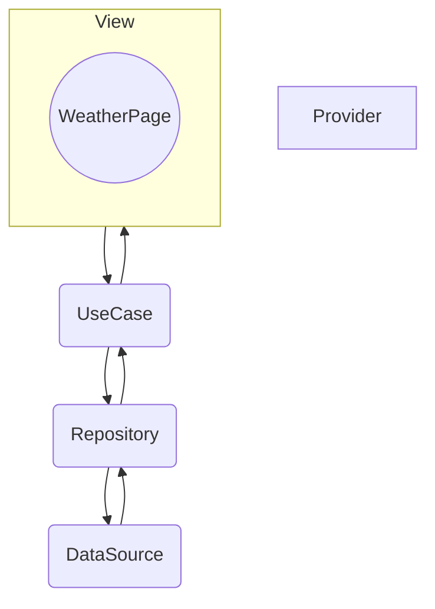

```mermaid
flowchart TB
  Provider
  subgraph View
    direction TB
      WeatherPage((WeatherPage))
  end

  View(View)
  UseCase(UseCase)
  Repository(Repository)
  DataSource(DataSource)
  View --> UseCase
  UseCase --> View
  Repository --> UseCase
  UseCase --> Repository
  DataSource --> Repository
  Repository --> DataSource
```
